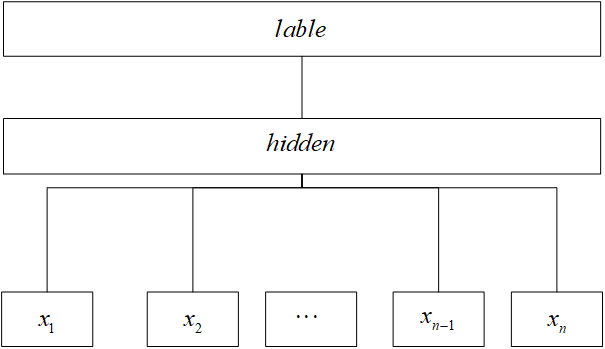

# 1.相关技术介绍
## 1.1 词性标注与命名实体识别简介
每一句话都是有着各种各样的词语来构成的，比如给定一个句子
> 这儿是个非常优美的学校
> 对其的标注为“这儿/代词 是/动词 个/量词 非常/副词 优美/形容词 的/结构助词 学校/名词”

在中文之中我们会遇到一个词可能会有好多种词性，那么我们该如何识别这些词性呢。
在词性识别之中有着各种方法，比如最简单的就是统计出这个词为这个词性的概率最大，我们就默认为这个词性。很容易看出这样的算法很容易忽略掉一些特殊情况，这样是不可以取的。那么就有许多人提出了一下观点，比如使用马尔科夫模型、条件随机场模型进行词性的预测。这样就可以考虑到特殊情况了。

## 1.2马尔科夫模型（HMM模型）
### 1.2.1引理：N-gram模型简介：

>每一个句子都分为若干个词语构成，我们假设一个句子有n个词语组成。用概率论的语言来描述的话，这个用这个些词语组成一个句子的概率应为:

$$
\
{\rm{P}}(\omega _1 ,\omega _2 , \cdot  \cdot  \cdot ,\omega _{n - 1} ,\omega _n )
\
$$

>
>表示这些文本中的n个词语。那么我们可以由条件概率公式可以得出：
>
$$
\
{\rm{P}}(\omega _1 ,\omega _2 , \cdot  \cdot  \cdot ,\omega _{n - 1} ,\omega _n ) = P(\omega _1 )P(\omega _2 |\omega _1 )P(\omega _3 |\omega _1 ,\omega _2 ) \cdot  \cdot  \cdot P(\omega _i |\omega _1 ,\omega _2 , \cdot  \cdot  \cdot ,\omega _{i - 1} ) \cdot  \cdot  \cdot P(\omega _n |\omega _1 ,\omega _2 , \cdot  \cdot  \cdot ,\omega _{n - 1} )
\
$$

>根据公式我们可以知道，当文本的词语越多，预测的所需要的计算难度越大。于是有人想能不能根据几项发生的概率就可以推测出总的概率呢。于是就有人提出了n-gram模型，于是我们的计算就可以简化为下面的计算方式：

$$
\
P(\omega _i |\omega _1 ,\omega _2 , \cdot  \cdot  \cdot ,\omega _{i - 1} ) \approx P(\omega _i |\omega _{i - (k - 1)} ,\omega _2 , \cdot  \cdot  \cdot ,\omega _{i - 1} )
\
$$

>这就将模型的计算量降低，但值得注意的是。当k=1时，我们可以发现：

$$
\
{\rm{P}}(\omega _1 ,\omega _2 , \cdot  \cdot  \cdot ,\omega _{n - 1} ,\omega _n ) = P(\omega _1 )P(\omega _2 )P(\omega _3 ) \cdot  \cdot  \cdot P(\omega _i ) \cdot  \cdot  \cdot P(\omega _n )
\
$$

>就相当于各个词语的关系应该是相互独立的，这也会丢失了句子中的词序。所以我们在选择的时候应该选择k大于1的值。其中k的取值所成的模型叫做k-gram模型(如k=2，我们就称为2-gram模型)

### 1.2.2马尔科夫模型：

>马尔科夫模型是一个二元语言模型(2-gram 模型),马尔科夫假设每个输出仅仅和上一个输出有关，那么应有：

$$
\
P(out) \approx P(out_1 )P(out_2 |out_1 )P(out_3 |out_2 ) \cdot  \cdot  \cdot P(out_n |out_{n - 1} )(1)
\
$$

>又因为当输入和输出的关系如下：

$$
\
P(out|input) = P(out,input)/P(input) = P(input|out)P(out)/P(input)
\
$$

>根据极大似然的思想，我们就可以知道：

$$
\
\max (P(input|out)P(out))
\
$$

>所求出来的值就是似然估计的值，接下来计算：

$$
\
P(input|out) \approx P(input_1 |out_1 )P(input_2 |out_2 )P(input_3 |out_3 ) \cdot  \cdot  \cdot P(input_n |out_n )(2)
\
$$

>联立（1）（2）我们就可以计算出就可以将似然估计值计算出来，得到的参数就是预测的值，因为他只和前面发生的事件有关，我们可以使用动态规划的算法解决，比如Veterbi算法。

## 1.3 中文分词工具

为快速实现中文分析，解决语料库、词典库不足导致分词不准问题。基于后面的研究的需求，不得使用比较好的分词工具。在这我引入了Jieba分词工具和THULAC分词工具，jieba分词工具就是根据马尔科夫模型进行分词，使用veterbi算法进行推导的一个分词工具。

并且Jieba分词工具在Github上表现极为活跃，很多人都在不断的增加语料库，并且持续更新，适合长期的使用。并且Jieba分词在各种语言之中都很兼容，容易进行扩展。使用起来也很简单不用太多的语句。分词的效果上也很明显，准确率很高。可以用于后面的词向量生成，进行提供比较准确的文本词汇进行深度学习。

当然也可以选择清华大学研究的分词工具THULAC，这个工具使用了世界最大的中文分词库进行训练，识别准确率也十分的高。在系统中我会选择这两个分词工具来进行分词的计算。

## 1.4  BM25算法简介

BM25算法是一个计算文本中的所有词语和文档相关度的算法，主要是分为三个部分的计算。分别为IDF、TF和Score的计算。

IDF的计算如下：
$$
\
IDF(q_i ) = \log \frac{{N - n(q_i ) + 0.5}}{{n(q_i ) + 0.5}}
\
$$
qi表示文本query集中的一个词语，N表示文档的总个数,n(qi)表示文档中出现qi

的个数，0.5作为一个调节系数，主要是防止分母为0的情况。

TF的计算如下：
$$
\
R(q_i ,d) = \frac{{f_i  \cdot (k_1  + 1)}}{{f_i  + K}}
\
$$
其中K的计算方式如下：
$$
\
K = k_1 (1 - b + b \cdot \frac{{dl}}{{avgdl}})
\
$$
其中k1为常数做调节系数,fi为该词在文档中出现的次数，dl为文档的长度,avgdl表示平均文档的长度。

最后就可以计算Score的值：
$$
\
Score(Q,d) = \sum\limits_i^n {IDF(q_i ) \cdot R(q_i } ,d)
\
$$

通过上面的计算就可以完成BM25算法的实现，计算相关度的问题就可以解决。

## 1.5 TextRank算法简介

TextRank算法，它有一个很明显的特征就是它提取关键词不需要语料库。不需要通过语料库的学习，就可以提取出关键词。是最早使用在关键词提取的一个算法，它通过对每一个句子进行打分的方式，选出最高分的一个句子作为关键句。这也达到了自动摘要的目的，下面我们连简述一下它的原理：

TextRank算法的思路源于PageRank算法。PageRank算法，顾名思义就是页面的权重的算法，算法早期用于谷歌的搜索引擎中。我们都知道在百度中输入一个关键字，然后点击“百度一下”就会得到很多的页面。那么这些页面是如何排序的呢，我们怎么样将用户需要搜索到的页面链接呈现给用户。这也成为了这个算法需要研究的一个核心问题。

PageRank算法是网页权重计算的算法，其核心思想有两点：

（1）    一个网页被很多的其它网页链接，它的权重就大。

（2）    一个网页被很大的权重的网页链接，它的权重就大。

我们容易看出一个点的权重和网页链接的数目有关，和链接它的网页的权重有关。那我们就可以推出一个计算公式。
$$
\
S(V_i ) = (1 - d) + d\sum\limits_{j \in In(V_j )} {\frac{{S(V_j )}}{{|Out(V_j )|}}} 
\
$$
TextRank算法就是基于这个思路进行运算的，那么你们可能会问，一段文本是链表类型的，不是图的类型。那么词和词之间又没有链接，那么我们应该如何去运算呢？这个问题就有学者提出了窗口的概念。就想TCP的滑动窗口一样，以一个固定的值作为窗口的大小进行词的划分，划分出来的窗口就是有联系的。这样我们就可以使用PageRank的思路了，最后得到文档的关键词。这就是TextRank算法的核心思想，当然这也是可以套用在关键词的提取上。

## 1.6 FastText模型简介

FastText是一个开源的文本分类器，它相对于卷积神经网络的相比，明显可以看出FastText跑得非常的快。在文本分类的效果上和卷积神经网络也是差不多的效果。

FastText模型可以分为简单的三层，第一层为输入层，第二层为隐藏层，第三层为输出层。属于浅层神经网络。

第一层输入层，将数据进行预处理。构成one-hot编码的向量。这一部分需要对文本进行分词，删除干扰项。保证输入层的数据的有效性。

第二层是隐藏层，隐藏层使用了分层的softmax替代了标准的softmax加速了运算。通过前向传播的方式传递给输出层。

第三层是输出层，通过隐藏成传过的数值进行标签的预测。也可以通过反向传播的方式来对学习权重矩阵的更改，使用梯度下降算法，不断纠正模型。

模型如下：

通过这x1,x2,...,xn这些词向量，经过分词去除干扰项。将向量通过线性变换之后进入隐藏层中，隐藏层通过EM算法，解出一个最大概率的值作为预测值，输出一个label的值，然后通过值到label集中寻找label值代表的意义。

